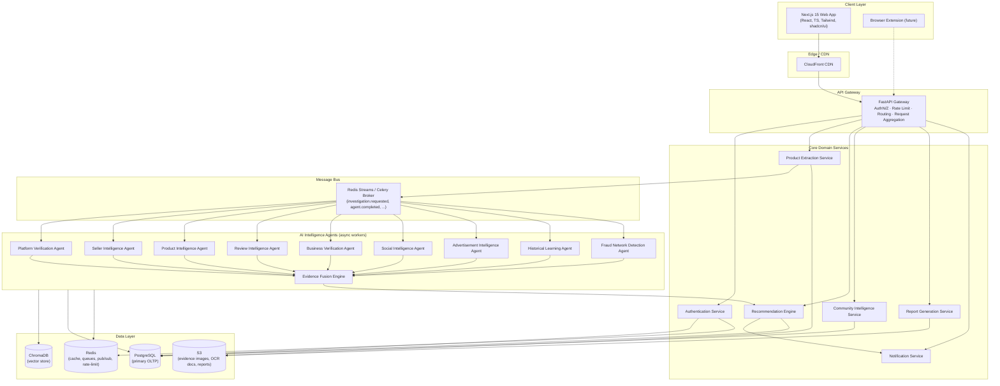
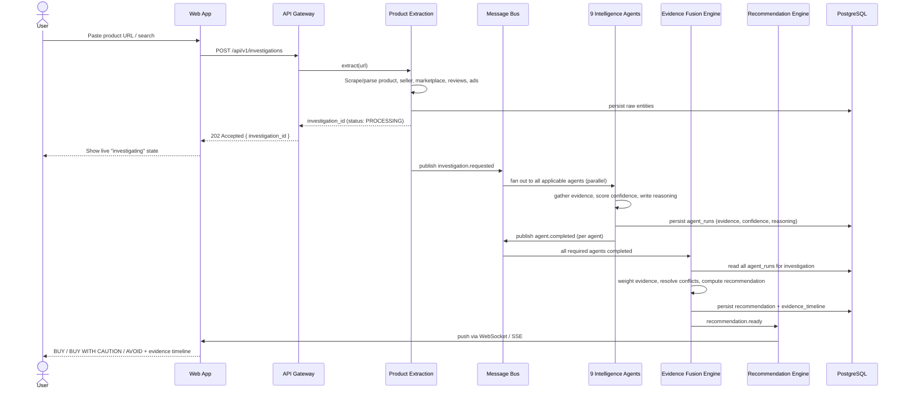
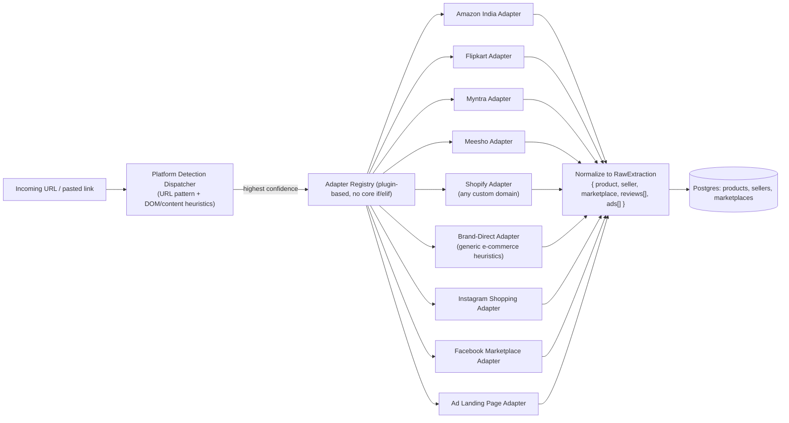
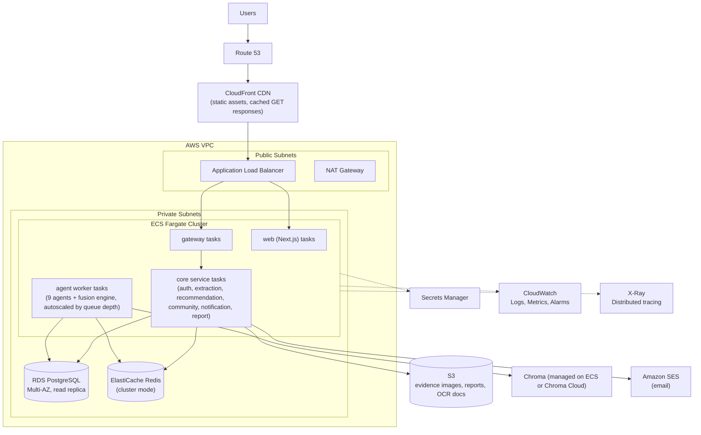

# TrustBuy AI — System Architecture

Related: [DATABASE_SCHEMA.md](DATABASE_SCHEMA.md) · [API_DOCUMENTATION.md](API_DOCUMENTATION.md) · [docs/SECURITY.md](docs/SECURITY.md) · [DECISIONS.md](DECISIONS.md)

## 1. Architectural style

TrustBuy AI is designed as a **microservices system with clean service boundaries**, orchestrated behind a single API Gateway, with an **asynchronous multi-agent AI pipeline** as its core differentiator. See **ADR-002** in [DECISIONS.md](DECISIONS.md) for the phased deployment strategy (logical microservices from day one; physically deployed as fewer units until traffic justifies splitting them — this keeps the architecture below as the permanent target without forcing premature operational overhead).

Guiding principles:

- **Evidence over scores.** Every service returns `{ evidence[], confidence, reasoning }`, never a bare number.
- **Explainability is a first-class contract.** The Evidence Fusion Engine cannot emit a recommendation without a traceable path back to source evidence.
- **Async by default for AI work.** Investigations take seconds to minutes; the API returns an `investigation_id` immediately and streams/pushes updates.
- **Idempotent, replayable agents.** Every agent run is persisted (`agent_runs`) so recommendations can be audited and re-derived.

## 2. High-level system diagram



## 3. Request lifecycle: "Should I buy this?"



## 4. Microservice architecture

Each service owns its data, exposes a REST API (see [API_DOCUMENTATION.md](API_DOCUMENTATION.md)), and communicates cross-service only through the gateway (sync) or the message bus (async). No service reaches into another service's database.

| # | Service | Responsibility | Sync/Async | Depends on |
|---|---|---|---|---|
| 1 | **Authentication Service** | Signup/login, JWT issuance/refresh, RBAC, session/device management | Sync | Postgres, Redis |
| 2 | **Product Extraction Service** | Auto-detect the source platform and dispatch to the matching pluggable adapter to resolve a URL into structured Product, Seller, Marketplace entities; kicks off investigations | Sync (ingest) + publishes async | Postgres, S3, headless-browser fetcher |
| 3 | **Platform Verification Agent** | Marketplace/domain legitimacy: age, SSL, business registration, hosting patterns, known-scam infra | Async | Postgres, external WHOIS/SSL APIs |
| 4 | **Seller Intelligence Agent** | Seller DNA Profile: account age, ownership changes, linked storefronts, complaint velocity, fulfillment consistency | Async | Postgres, Chroma |
| 5 | **Product Intelligence Agent** | Counterfeit indicators, spec/image mismatch, product-similarity search, listing manipulation | Async | Chroma, OpenCV, OCR |
| 6 | **Review Intelligence Agent** | Review authenticity: burst detection, template/duplicate detection, sentiment-vs-rating mismatch, reviewer graph | Async | Sentence-Transformers, Chroma |
| 7 | **Business Verification Agent** | Legal entity resolution, registration status, sanctions/consumer-complaint databases | Async | Postgres, external registries |
| 8 | **Social Intelligence Agent** | Cross-platform footprint (social presence age, engagement authenticity, influencer-ad correlation) | Async | External APIs, spaCy |
| 9 | **Advertisement Intelligence Agent** | Ad-claim vs. product-reality checks, dark-pattern & bait-and-switch detection | Async | spaCy, Sentence-Transformers |
| 10 | **Community Intelligence Service** | Reports, verifications, votes, badges, reputation weighting, spam/duplicate detection | Sync + Async | Postgres, Redis |
| 11 | **Historical Learning Agent** | Price-history & manipulation detection, purchase-regret prediction, outcome feedback loop | Async | Postgres (time-series), scikit-learn |
| 12 | **Fraud Network Detection Agent** | Graph construction/analysis linking sellers, products, accounts, payment handles by shared fraud signals | Async | Postgres (graph tables), NetworkX |
| 13 | **Evidence Fusion Engine** | Consumes all agent outputs, resolves conflicts, computes final recommendation + confidence + explanation | Async | Postgres |
| 14 | **Recommendation Engine** | Serves finished recommendations, alternative sellers, regret prediction to the client; owns the AI Purchase Copilot | Sync | Postgres, Chroma, LLM provider |
| 15 | **Notification Service** | Push/email/in-app notifications (investigation ready, report status, badge earned) | Async | Redis, SES |
| 16 | **Report Generation Service** | Exportable PDF/HTML evidence reports for a given investigation | Sync | S3, Postgres |

### 4.1 Marketplace Adapter Architecture (ADR-008)

TrustBuy AI is **platform-agnostic by design** — the Product Extraction Service never hardcodes marketplace-specific logic in its core. Instead it dispatches to a pluggable `SourceAdapter`:



**Contract every adapter implements** (`trustbuy_extraction_sdk.SourceAdapter`):
```python
class SourceAdapter(Protocol):
    platform_type: str                    # e.g. "amazon_in", "instagram_shopping"

    def detect(self, url: str, page_content: bytes) -> float:
        """Return 0..1 confidence this adapter owns this source."""

    def extract(self, url: str, page_content: bytes) -> RawExtraction:
        """Normalize the source into the common product/seller/marketplace shape."""
```

**Rules:**
- New sources are added as **new adapter packages** (`services/product-extraction-service/adapters/*`) registered into the dispatcher — never by editing core extraction logic. A PR that branches on domain name outside an adapter package fails review.
- Sources without a marketplace-issued seller ID (Instagram shopping, Facebook Marketplace, ad landing pages) still normalize into `sellers`/`marketplaces` — see [DATABASE_SCHEMA.md](DATABASE_SCHEMA.md) §2.2 `platform_type` / `source_identifier`.
- **Initial 9 adapters** (per product owner requirement): Amazon India, Flipkart, Myntra, Meesho, Shopify stores, official brand websites, Instagram shopping links, Facebook Marketplace, advertisement landing pages. Rollout sequencing (framework + 2 pilot adapters first, remainder incremental) is in [ROADMAP.md](ROADMAP.md) Phase 2.

### 4.2 Why 9 agents feed 1 Fusion Engine, not each other

Agents run independently and in parallel so a slow/failed agent (e.g., an external registry timeout) never blocks the others. The Fusion Engine is the **only** place where cross-agent reasoning happens, which keeps each agent simple, testable, and independently deployable — and keeps the final explanation auditable to one component.

## 5. AI agent architecture (detail)

```mermaid
flowchart LR
    subgraph Input
        E["Investigation Context\n(product, seller, marketplace, reviews, ads, business)"]
    end

    subgraph AgentContract["Every agent implements the same contract"]
        direction TB
        C1["gather_evidence(context) -> Evidence[]"]
        C2["score_confidence(evidence) -> float 0..1"]
        C3["explain(evidence) -> reasoning string"]
    end

    subgraph Outputs["AgentResult (persisted to agent_runs)"]
        O["{ agent, verdict_signal, evidence[], confidence, reasoning, sources[], duration_ms }"]
    end

    subgraph FusionEngine["Evidence Fusion Engine"]
        direction TB
        F1["1. Collect all AgentResults for investigation_id"]
        F2["2. Normalize signals to a common evidence schema"]
        F3["3. Apply reliability weights per agent\n(tunable, versioned weight table)"]
        F4["4. Detect and surface conflicting evidence\n(never silently discard it)"]
        F5["5. Apply community-reputation adjustment\n(verified user reports increase/decrease weight)"]
        F6["6. Compute final recommendation\nBUY / BUY WITH CAUTION / AVOID"]
        F7["7. Generate natural-language explanation\nciting the strongest evidence for and against"]
    end

    E --> AgentContract --> Outputs --> FusionEngine --> R["Recommendation\n+ Evidence Timeline\n+ Confidence\n+ Alternatives"]
```



**Design rules for every agent:**
1. An agent **never** outputs a bare score — it outputs evidence items, each with `source`, `weight`, `polarity (supports/contradicts/neutral)`, and a one-line human-readable reason.
2. An agent that cannot gather evidence (timeout, blocked, no data) reports `confidence: 0` and `status: INSUFFICIENT_DATA` — it never guesses.
3. Agent weight tables are versioned (`agent_weight_version`) so recommendation changes over time are explainable ("the model was updated on X") rather than mysterious drift.

## 6. AI Purchase Copilot

The Copilot is **not a general chatbot**. It is scoped to a single investigation's context window and a fixed intent set:

- Explain the recommendation ("Why did you recommend BUY?")
- Surface specific weak/strong evidence ("Which reviews look fake?")
- Compare 2+ sellers side-by-side
- Explain a specific signal (e.g. counterfeit indicators)
- Request deeper evidence ("show stronger evidence")
- Suggest trusted alternatives
- Answer "buy now or wait" using price-history evidence

Out-of-scope questions are declined with a redirect, enforced by a system prompt **and** a lightweight intent classifier in front of the LLM call (defense in depth, not prompt-only). The Copilot retrieves grounding context via ChromaDB (investigation evidence + relevant community reports) — it is retrieval-grounded, not free-generating, to keep answers evidence-backed.

## 7. Folder structure (monorepo)

**As-built note (2026-08-07, see [PROJECT_REPORT.md](PROJECT_REPORT.md) for full detail):** the target tree below remains the north star; what's actually on disk today differs in a few tracked ways, each an explicit decision, not drift:
- `product-extraction-service` and `recommendation-engine` were folded into one **`catalog-service`**, matching ADR-002's phased grouping and ADR-011's in-process pipeline - it owns extraction, investigations, the AI Purchase Copilot, PDF report export, and its own `admin_routes.py`.
- `services/agents/*` doesn't exist as separate packages yet - the 4 built agents live as modules inside `catalog-service/app/agents/`, sharing one process (ADR-011). They'll split out once the queue-based worker fleet replaces the in-process orchestrator.
- `report-generation-service` was folded into `catalog-service` (`app/report_pdf.py`) rather than standing alone - same rationale.
- `notification-service` does not exist yet (Known Limitation, see [PROJECT_REPORT.md](PROJECT_REPORT.md) §8).
- `infra/terraform/` does not exist yet - see [DEPLOYMENT_GUIDE.md](DEPLOYMENT_GUIDE.md) §5 for the manual bridge.
- Two new root docs exist beyond this list: **`PROJECT_REPORT.md`** and **`DEPLOYMENT_GUIDE.md`**.

```
trustbuy-ai/
├── apps/
│   └── web/                          # Next.js 15 app
│       ├── app/                      # App Router: (marketing)/, (app)/, (admin)/
│       ├── components/               # ui/ (shadcn primitives), features/, layout/
│       ├── lib/                      # api client (axios), query hooks (TanStack Query)
│       ├── hooks/
│       ├── stores/                   # lightweight client state
│       ├── types/                    # shared TS types (generated from OpenAPI)
│       └── styles/
│
├── services/
│   ├── gateway/                      # FastAPI API Gateway
│   ├── auth-service/
│   ├── product-extraction-service/
│   ├── recommendation-engine/
│   ├── community-service/
│   ├── notification-service/
│   ├── report-generation-service/
│   └── agents/
│       ├── platform-verification-agent/
│       ├── seller-intelligence-agent/
│       ├── product-intelligence-agent/
│       ├── review-intelligence-agent/
│       ├── business-verification-agent/
│       ├── social-intelligence-agent/
│       ├── advertisement-intelligence-agent/
│       ├── historical-learning-agent/
│       ├── fraud-network-agent/
│       └── evidence-fusion-engine/
│
├── libs/                             # shared Python packages (installed editable)
│   ├── trustbuy_common/              # base models, error types, logging, tracing
│   ├── trustbuy_auth/                # JWT verification middleware, RBAC decorators
│   ├── trustbuy_agent_sdk/           # BaseAgent, Evidence, AgentResult contracts
│   └── trustbuy_db/                  # SQLAlchemy models, Alembic migrations (shared schema)
│
├── infra/
│   ├── docker/                       # per-service Dockerfiles
│   ├── docker-compose.yml            # local dev: all services + Postgres + Redis + Chroma
│   ├── terraform/                    # AWS infra as code (VPC, ECS, RDS, ElastiCache, S3, CloudFront)
│   └── github-actions/               # CI/CD workflows
│
├── docs/                             # architecture & process docs (this set)
├── README.md
├── ARCHITECTURE.md
├── DATABASE_SCHEMA.md
├── API_DOCUMENTATION.md
├── ROADMAP.md
├── DECISIONS.md
├── CHANGELOG.md
└── PROJECT_PROGRESS.md
```

## 8. Deployment architecture (AWS)



- **Compute:** ECS Fargate (no server management pre-scale); migration path to EKS documented in [ROADMAP.md](ROADMAP.md) future scope if/when custom scheduling or GPU inference is needed.
- **Autoscaling:** core services scale on request latency/CPU; agent workers scale on **queue depth** (investigations pending), since AI work is bursty.
- **CI/CD:** GitHub Actions build/push per-service Docker images to ECR, run migrations via a one-off ECS task, then rolling-deploy.
- **Environments:** `dev` → `staging` → `production`, isolated AWS accounts via AWS Organizations (see [docs/SECURITY.md](docs/SECURITY.md)).

## 9. Security architecture (summary)

Full detail in [docs/SECURITY.md](docs/SECURITY.md). Highlights:

- JWT access tokens (short-lived, 15 min) + rotating refresh tokens (httpOnly, secure cookie), RBAC (`user`, `moderator`, `admin`).
- All inter-service calls inside the VPC; gateway is the only public ingress besides the web app.
- Secrets in AWS Secrets Manager, never in env files or images.
- Rate limiting per-IP and per-user at the gateway (Redis token bucket).
- Input validation via Pydantic v2 models at every service boundary.
- PII (uploaded invoices, delivery images) encrypted at rest (S3 SSE-KMS) and access-logged.

## 10. Observability

- Structured JSON logging (`trustbuy_common`) shipped to CloudWatch.
- Distributed tracing (OpenTelemetry → X-Ray) across gateway → service → agent → fusion, so a single investigation can be traced end-to-end.
- Business metrics dashboard: investigations/day, agent success rate, average confidence, false-positive reports (from community disputes).
