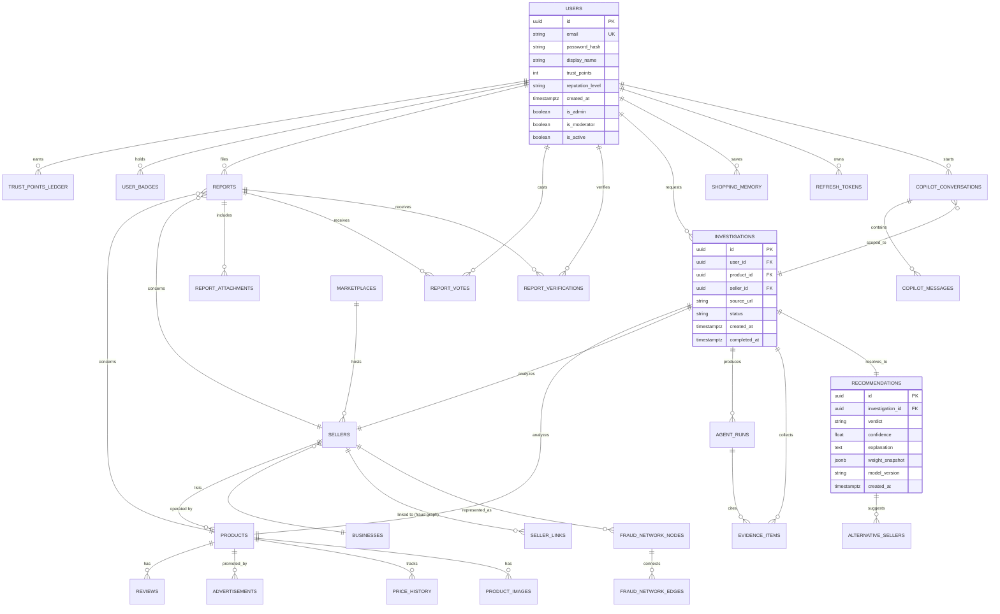

# TrustBuy AI — Database Schema

Related: [ARCHITECTURE.md](ARCHITECTURE.md) · [API_DOCUMENTATION.md](API_DOCUMENTATION.md)

Primary store: **PostgreSQL 16**. Vector store: **ChromaDB** (embeddings for products, reviews, evidence — referenced from Postgres by `chroma_id`, never duplicated as source of truth). Object store: **S3** (images, invoices, OCR source docs — referenced by `s3_key`).

Each microservice **owns** a subset of tables and is the only writer to them; other services read through APIs, not direct SQL, except the shared read-only analytics replica.

**As-built note (2026-08-07)**: 4 migrations are applied and verified (`0001` auth, `0002` catalog/investigation, `0003` community, `0004` copilot - see `libs/trustbuy_db/alembic/versions/`). Real deltas from this document's original design, all intentional and logged in [DECISIONS.md](DECISIONS.md):
- `report_attachments.storage_key` (not `s3_key`) - backed by a pluggable `StorageProvider` (local disk by default, S3 when configured), not S3-only (ADR-012).
- `investigations` gained `detected_platform` and `error_message` columns (operational additions - which adapter matched, and why a failed investigation failed).
- `recommendations` gained `explanation_source` (`"template"` or `"llm"`) so a client can honestly label whether an explanation came from the deterministic template or a real model call.
- `fraud_network_nodes`, `fraud_network_edges`, and `regret_predictions` from the original design **do not exist yet** - Fraud Network Detection and purchase-regret prediction were not built this session (see [PROJECT_REPORT.md](PROJECT_REPORT.md) §8).
- ChromaDB is running in the stack but **not yet consumed by any service** - no embeddings are written or read yet; every `chroma_id` column exists but is unused.

## 1. Entity-Relationship Diagram



## 2. Core schema (by owning service)

### 2.1 Authentication Service

```sql
CREATE TABLE users (
    id                  UUID PRIMARY KEY DEFAULT gen_random_uuid(),
    email               CITEXT UNIQUE NOT NULL,
    password_hash       TEXT NOT NULL,               -- bcrypt/argon2id
    display_name        VARCHAR(80) NOT NULL,
    avatar_url          TEXT,
    trust_points        INTEGER NOT NULL DEFAULT 0,
    reputation_level     VARCHAR(20) NOT NULL DEFAULT 'shopper',
        -- shopper | investigator | fraud_hunter | trust_guardian | trust_ambassador
    is_admin            BOOLEAN NOT NULL DEFAULT FALSE,
    is_moderator        BOOLEAN NOT NULL DEFAULT FALSE,
    is_active           BOOLEAN NOT NULL DEFAULT TRUE,
    email_verified_at   TIMESTAMPTZ,
    created_at          TIMESTAMPTZ NOT NULL DEFAULT now(),
    updated_at          TIMESTAMPTZ NOT NULL DEFAULT now()
);

CREATE TABLE refresh_tokens (
    id              UUID PRIMARY KEY DEFAULT gen_random_uuid(),
    user_id         UUID NOT NULL REFERENCES users(id) ON DELETE CASCADE,
    token_hash      TEXT NOT NULL,
    device_label    VARCHAR(120),
    ip_address      INET,
    issued_at       TIMESTAMPTZ NOT NULL DEFAULT now(),
    expires_at      TIMESTAMPTZ NOT NULL,
    revoked_at      TIMESTAMPTZ
);

CREATE TABLE audit_logs (
    id          BIGSERIAL PRIMARY KEY,
    actor_id    UUID REFERENCES users(id),
    action      VARCHAR(80) NOT NULL,
    entity_type VARCHAR(50),
    entity_id   UUID,
    metadata    JSONB,
    ip_address  INET,
    created_at  TIMESTAMPTZ NOT NULL DEFAULT now()
);
```

### 2.2 Product Extraction / Catalog

Populated by whichever adapter matched the source (see [ARCHITECTURE.md](ARCHITECTURE.md) §4.1); the schema below is the common normalized shape every adapter — Amazon India, Flipkart, Myntra, Meesho, Shopify, brand-direct, Instagram shopping, Facebook Marketplace, ad landing pages — writes into. `sellers.external_seller_id` holds whatever the source's stable seller key is (marketplace seller ID, Shopify store ID, Instagram account handle, Facebook Page ID); it is opaque to the schema and interpreted only by its owning adapter.

```sql
-- platform_type identifies which pluggable adapter (see ARCHITECTURE.md §4.1) owns this source.
-- domain is nullable because social/ad-driven sources (Instagram shopping, ad landing pages)
-- may not resolve to one stable domain; source_identifier is the adapter-specific stable key
-- (domain for marketplaces/Shopify/brand sites, account handle for Instagram, page ID for
-- Facebook Marketplace, campaign/creative ID for ad landing pages).
CREATE TABLE marketplaces (
    id                  UUID PRIMARY KEY DEFAULT gen_random_uuid(),
    platform_type       VARCHAR(30) NOT NULL,
        -- amazon_in | flipkart | myntra | meesho | shopify | brand_direct
        -- | instagram_shopping | facebook_marketplace | ad_landing_page | unknown
    domain              VARCHAR(255),
    source_identifier   VARCHAR(255) NOT NULL,   -- stable adapter-specific key, see note above
    display_name        VARCHAR(120),
    domain_age_days     INTEGER,
    ssl_valid           BOOLEAN,
    country             VARCHAR(2),
    risk_flags          JSONB DEFAULT '[]',
    adapter_version      VARCHAR(20) NOT NULL,     -- which adapter build extracted this, for audit/replay
    first_seen_at       TIMESTAMPTZ NOT NULL DEFAULT now(),
    last_checked_at     TIMESTAMPTZ,
    UNIQUE (platform_type, source_identifier)
);

CREATE TABLE businesses (
    id                  UUID PRIMARY KEY DEFAULT gen_random_uuid(),
    legal_name          VARCHAR(255),
    registration_number VARCHAR(120),
    registration_country VARCHAR(2),
    registration_status VARCHAR(30),   -- active | dissolved | unverifiable
    incorporation_date  DATE,
    verified_at         TIMESTAMPTZ,
    metadata            JSONB DEFAULT '{}'
);

CREATE TABLE sellers (
    id                  UUID PRIMARY KEY DEFAULT gen_random_uuid(),
    marketplace_id      UUID NOT NULL REFERENCES marketplaces(id),
    business_id         UUID REFERENCES businesses(id),
    external_seller_id  VARCHAR(255) NOT NULL,       -- id on the marketplace itself
    display_name        VARCHAR(255),
    account_created_at  DATE,
    fulfillment_type    VARCHAR(30),                  -- self | fba-like | dropship | unknown
    complaint_count     INTEGER NOT NULL DEFAULT 0,
    dna_profile         JSONB DEFAULT '{}',            -- computed Seller DNA snapshot
    created_at          TIMESTAMPTZ NOT NULL DEFAULT now(),
    UNIQUE (marketplace_id, external_seller_id)
);

CREATE TABLE seller_links (
    id              UUID PRIMARY KEY DEFAULT gen_random_uuid(),
    seller_id       UUID NOT NULL REFERENCES sellers(id),
    linked_seller_id UUID NOT NULL REFERENCES sellers(id),
    link_type       VARCHAR(40),        -- shared_payment_handle | shared_address | shared_images | shared_business
    confidence      FLOAT NOT NULL,
    evidence        JSONB DEFAULT '[]',
    created_at      TIMESTAMPTZ NOT NULL DEFAULT now(),
    CHECK (seller_id <> linked_seller_id)
);

CREATE TABLE products (
    id              UUID PRIMARY KEY DEFAULT gen_random_uuid(),
    seller_id       UUID NOT NULL REFERENCES sellers(id),
    external_product_id VARCHAR(255),
    title           TEXT NOT NULL,
    description     TEXT,
    category        VARCHAR(120),
    current_price   NUMERIC(12,2),
    currency        CHAR(3) DEFAULT 'USD',
    listing_url     TEXT NOT NULL,
    chroma_id        VARCHAR(64),        -- embedding reference for similarity search
    created_at      TIMESTAMPTZ NOT NULL DEFAULT now(),
    updated_at      TIMESTAMPTZ NOT NULL DEFAULT now()
);

CREATE TABLE product_images (
    id          UUID PRIMARY KEY DEFAULT gen_random_uuid(),
    product_id  UUID NOT NULL REFERENCES products(id) ON DELETE CASCADE,
    s3_key      TEXT NOT NULL,
    is_primary  BOOLEAN DEFAULT FALSE,
    ocr_text    TEXT,
    perceptual_hash VARCHAR(64),          -- for reverse/duplicate image detection
    created_at  TIMESTAMPTZ NOT NULL DEFAULT now()
);

CREATE TABLE price_history (
    id          BIGSERIAL PRIMARY KEY,
    product_id  UUID NOT NULL REFERENCES products(id) ON DELETE CASCADE,
    price       NUMERIC(12,2) NOT NULL,
    listed_as_discount_from NUMERIC(12,2),
    recorded_at TIMESTAMPTZ NOT NULL DEFAULT now()
);
CREATE INDEX idx_price_history_product_time ON price_history(product_id, recorded_at);

CREATE TABLE reviews (
    id              UUID PRIMARY KEY DEFAULT gen_random_uuid(),
    product_id      UUID NOT NULL REFERENCES products(id) ON DELETE CASCADE,
    external_review_id VARCHAR(255),
    reviewer_handle VARCHAR(255),
    rating          SMALLINT CHECK (rating BETWEEN 1 AND 5),
    body            TEXT,
    posted_at       TIMESTAMPTZ,
    chroma_id        VARCHAR(64),
    authenticity_score FLOAT,             -- 0 (fake) .. 1 (authentic), from Review Intelligence Agent
    authenticity_signals JSONB DEFAULT '[]',
    created_at      TIMESTAMPTZ NOT NULL DEFAULT now()
);

CREATE TABLE advertisements (
    id          UUID PRIMARY KEY DEFAULT gen_random_uuid(),
    product_id  UUID REFERENCES products(id),
    seller_id   UUID REFERENCES sellers(id),
    platform    VARCHAR(60),             -- meta | google | tiktok | native
    ad_text     TEXT,
    creative_s3_key TEXT,
    claims_extracted JSONB DEFAULT '[]',
    claim_mismatches JSONB DEFAULT '[]',
    first_seen_at TIMESTAMPTZ NOT NULL DEFAULT now()
);
```

### 2.3 Investigation & AI pipeline (shared by all agents + Fusion Engine)

```sql
CREATE TABLE investigations (
    id              UUID PRIMARY KEY DEFAULT gen_random_uuid(),
    user_id         UUID REFERENCES users(id),        -- nullable: anonymous investigations allowed
    product_id      UUID NOT NULL REFERENCES products(id),
    seller_id       UUID NOT NULL REFERENCES sellers(id),
    source_url      TEXT NOT NULL,
    status          VARCHAR(20) NOT NULL DEFAULT 'processing',
        -- processing | completed | failed | partial
    created_at      TIMESTAMPTZ NOT NULL DEFAULT now(),
    completed_at    TIMESTAMPTZ
);
CREATE INDEX idx_investigations_user ON investigations(user_id, created_at DESC);

CREATE TABLE agent_runs (
    id              UUID PRIMARY KEY DEFAULT gen_random_uuid(),
    investigation_id UUID NOT NULL REFERENCES investigations(id) ON DELETE CASCADE,
    agent_name      VARCHAR(60) NOT NULL,
        -- platform_verification | seller_intelligence | product_intelligence | review_intelligence
        -- | business_verification | social_intelligence | advertisement_intelligence
        -- | historical_learning | fraud_network
    status          VARCHAR(20) NOT NULL,             -- completed | failed | insufficient_data | timeout
    verdict_signal  VARCHAR(20),                       -- supports_buy | supports_caution | supports_avoid | neutral
    confidence      FLOAT NOT NULL DEFAULT 0,
    reasoning       TEXT,
    weight_version  VARCHAR(20) NOT NULL,
    duration_ms     INTEGER,
    raw_output      JSONB,
    started_at      TIMESTAMPTZ NOT NULL DEFAULT now(),
    completed_at    TIMESTAMPTZ
);
CREATE INDEX idx_agent_runs_investigation ON agent_runs(investigation_id);

CREATE TABLE evidence_items (
    id              UUID PRIMARY KEY DEFAULT gen_random_uuid(),
    investigation_id UUID NOT NULL REFERENCES investigations(id) ON DELETE CASCADE,
    agent_run_id    UUID REFERENCES agent_runs(id) ON DELETE CASCADE,
    source_type     VARCHAR(40) NOT NULL,   -- agent | community_report | historical_record
    polarity        VARCHAR(12) NOT NULL,   -- supports | contradicts | neutral
    weight          FLOAT NOT NULL,
    summary         TEXT NOT NULL,
    detail          JSONB DEFAULT '{}',
    occurred_at     TIMESTAMPTZ,             -- when the underlying event happened (for the timeline)
    created_at      TIMESTAMPTZ NOT NULL DEFAULT now()
);
CREATE INDEX idx_evidence_investigation_time ON evidence_items(investigation_id, occurred_at);

CREATE TABLE recommendations (
    id              UUID PRIMARY KEY DEFAULT gen_random_uuid(),
    investigation_id UUID NOT NULL UNIQUE REFERENCES investigations(id) ON DELETE CASCADE,
    verdict         VARCHAR(20) NOT NULL,    -- buy | buy_with_caution | avoid_purchase
    confidence      FLOAT NOT NULL,
    explanation     TEXT NOT NULL,
    weight_snapshot JSONB NOT NULL,          -- agent weight table used, for reproducibility
    model_version   VARCHAR(30) NOT NULL,
    created_at      TIMESTAMPTZ NOT NULL DEFAULT now()
);

CREATE TABLE alternative_sellers (
    id                  UUID PRIMARY KEY DEFAULT gen_random_uuid(),
    recommendation_id   UUID NOT NULL REFERENCES recommendations(id) ON DELETE CASCADE,
    alternative_product_id UUID NOT NULL REFERENCES products(id),
    rank                SMALLINT NOT NULL,
    reason              TEXT NOT NULL,
    similarity_score    FLOAT
);

CREATE TABLE regret_predictions (
    id              UUID PRIMARY KEY DEFAULT gen_random_uuid(),
    investigation_id UUID NOT NULL REFERENCES investigations(id) ON DELETE CASCADE,
    regret_probability FLOAT NOT NULL,
    contributing_factors JSONB DEFAULT '[]',
    created_at      TIMESTAMPTZ NOT NULL DEFAULT now()
);
```

### 2.4 Fraud Network Detection

```sql
CREATE TABLE fraud_network_nodes (
    id          UUID PRIMARY KEY DEFAULT gen_random_uuid(),
    node_type   VARCHAR(30) NOT NULL,   -- seller | payment_handle | address | phone | device_fingerprint
    node_key    TEXT NOT NULL,           -- normalized identifier
    seller_id   UUID REFERENCES sellers(id),
    risk_score  FLOAT NOT NULL DEFAULT 0,
    created_at  TIMESTAMPTZ NOT NULL DEFAULT now(),
    UNIQUE (node_type, node_key)
);

CREATE TABLE fraud_network_edges (
    id          UUID PRIMARY KEY DEFAULT gen_random_uuid(),
    source_node_id UUID NOT NULL REFERENCES fraud_network_nodes(id) ON DELETE CASCADE,
    target_node_id UUID NOT NULL REFERENCES fraud_network_nodes(id) ON DELETE CASCADE,
    relationship    VARCHAR(40) NOT NULL,  -- shares_payment | shares_address | shares_device | co_reported
    strength        FLOAT NOT NULL,
    evidence_ids    UUID[] DEFAULT '{}',
    created_at      TIMESTAMPTZ NOT NULL DEFAULT now()
);
```

### 2.5 Community Intelligence

```sql
CREATE TABLE reports (
    id              UUID PRIMARY KEY DEFAULT gen_random_uuid(),
    reporter_id     UUID NOT NULL REFERENCES users(id),
    report_type     VARCHAR(30) NOT NULL,
        -- fake_seller | counterfeit_product | scam | refund_dispute | genuine_confirmation
    product_id      UUID REFERENCES products(id),
    seller_id       UUID REFERENCES sellers(id),
    description     TEXT NOT NULL,
    status          VARCHAR(20) NOT NULL DEFAULT 'pending',
        -- pending | under_review | verified | rejected | duplicate
    duplicate_of_id UUID REFERENCES reports(id),
    content_hash    TEXT,                  -- for duplicate detection (simhash of description+attachments)
    upvotes         INTEGER NOT NULL DEFAULT 0,
    downvotes       INTEGER NOT NULL DEFAULT 0,
    reputation_weight_at_submission FLOAT NOT NULL,
    created_at      TIMESTAMPTZ NOT NULL DEFAULT now(),
    resolved_at     TIMESTAMPTZ
);
CREATE INDEX idx_reports_content_hash ON reports(content_hash);

CREATE TABLE report_attachments (
    id          UUID PRIMARY KEY DEFAULT gen_random_uuid(),
    report_id   UUID NOT NULL REFERENCES reports(id) ON DELETE CASCADE,
    kind        VARCHAR(30) NOT NULL,   -- invoice | delivery_image | refund_chat | screenshot
    s3_key      TEXT NOT NULL,
    ocr_text    TEXT,
    perceptual_hash VARCHAR(64),
    created_at  TIMESTAMPTZ NOT NULL DEFAULT now()
);

CREATE TABLE report_votes (
    id          UUID PRIMARY KEY DEFAULT gen_random_uuid(),
    report_id   UUID NOT NULL REFERENCES reports(id) ON DELETE CASCADE,
    user_id     UUID NOT NULL REFERENCES users(id),
    vote        SMALLINT NOT NULL CHECK (vote IN (-1, 1)),
    created_at  TIMESTAMPTZ NOT NULL DEFAULT now(),
    UNIQUE (report_id, user_id)
);

CREATE TABLE report_verifications (
    id          UUID PRIMARY KEY DEFAULT gen_random_uuid(),
    report_id   UUID NOT NULL REFERENCES reports(id) ON DELETE CASCADE,
    verifier_id UUID NOT NULL REFERENCES users(id),
    outcome     VARCHAR(20) NOT NULL,   -- confirms | disputes
    notes       TEXT,
    created_at  TIMESTAMPTZ NOT NULL DEFAULT now(),
    UNIQUE (report_id, verifier_id)
);

CREATE TABLE trust_points_ledger (
    id          BIGSERIAL PRIMARY KEY,
    user_id     UUID NOT NULL REFERENCES users(id),
    delta       INTEGER NOT NULL,
    reason      VARCHAR(60) NOT NULL,   -- report_verified | report_rejected | vote_cast | badge_bonus | penalty_spam
    reference_id UUID,                  -- e.g. report_id
    created_at  TIMESTAMPTZ NOT NULL DEFAULT now()
);

CREATE TABLE badges (
    id          UUID PRIMARY KEY DEFAULT gen_random_uuid(),
    code        VARCHAR(60) UNIQUE NOT NULL,
    name        VARCHAR(120) NOT NULL,
    description TEXT,
    icon        VARCHAR(60)
);

CREATE TABLE user_badges (
    user_id     UUID NOT NULL REFERENCES users(id),
    badge_id    UUID NOT NULL REFERENCES badges(id),
    awarded_at  TIMESTAMPTZ NOT NULL DEFAULT now(),
    PRIMARY KEY (user_id, badge_id)
);
```

### 2.6 Copilot, Notifications, Shopping Memory

```sql
CREATE TABLE copilot_conversations (
    id              UUID PRIMARY KEY DEFAULT gen_random_uuid(),
    user_id         UUID REFERENCES users(id),
    investigation_id UUID NOT NULL REFERENCES investigations(id),
    created_at      TIMESTAMPTZ NOT NULL DEFAULT now()
);

CREATE TABLE copilot_messages (
    id              UUID PRIMARY KEY DEFAULT gen_random_uuid(),
    conversation_id UUID NOT NULL REFERENCES copilot_conversations(id) ON DELETE CASCADE,
    role            VARCHAR(12) NOT NULL,  -- user | assistant
    content         TEXT NOT NULL,
    cited_evidence_ids UUID[] DEFAULT '{}',
    created_at      TIMESTAMPTZ NOT NULL DEFAULT now()
);

CREATE TABLE shopping_memory (
    id              UUID PRIMARY KEY DEFAULT gen_random_uuid(),
    user_id         UUID NOT NULL REFERENCES users(id),
    investigation_id UUID NOT NULL REFERENCES investigations(id),
    outcome         VARCHAR(20),   -- purchased | avoided | still_deciding
    outcome_notes   TEXT,
    saved_at        TIMESTAMPTZ NOT NULL DEFAULT now()
);

CREATE TABLE notifications (
    id          UUID PRIMARY KEY DEFAULT gen_random_uuid(),
    user_id     UUID NOT NULL REFERENCES users(id),
    type        VARCHAR(40) NOT NULL,
    payload     JSONB NOT NULL,
    read_at     TIMESTAMPTZ,
    created_at  TIMESTAMPTZ NOT NULL DEFAULT now()
);
```

## 3. Vector store design (ChromaDB)

| Collection | Embeds | Used by |
|---|---|---|
| `product_embeddings` | title + description + category | Product Intelligence Agent (similarity/counterfeit clustering), Alternative Sellers |
| `review_embeddings` | review body | Review Intelligence Agent (duplicate/template detection) |
| `evidence_embeddings` | evidence summaries per investigation | AI Purchase Copilot retrieval grounding |
| `report_embeddings` | community report descriptions | Duplicate report detection, Community Intelligence |

Each Chroma record stores `{ postgres_id, collection, metadata }` so results always resolve back to a relational row — Chroma is never the source of truth.

## 4. Retention & partitioning notes

- `price_history` and `agent_runs` are high-write, time-series-shaped tables — partition by month once volume justifies it (see [ROADMAP.md](ROADMAP.md) future scope).
- `audit_logs` retained 2 years minimum for dispute resolution.
- Report attachments (`report_attachments.s3_key`) follow the retention/deletion rules in [docs/SECURITY.md](docs/SECURITY.md).

## 5. Migrations

All schema changes go through **Alembic**, one migration per logical change, reviewed alongside the code that needs it. No manual DDL against staging/production.
