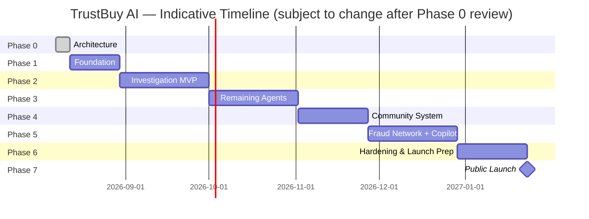

# TrustBuy AI — Development Roadmap & Timeline

Related: [ARCHITECTURE.md](ARCHITECTURE.md) · [PROJECT_PROGRESS.md](PROJECT_PROGRESS.md) · [docs/RISK_ANALYSIS.md](docs/RISK_ANALYSIS.md)

Built one phase at a time. A phase is not started until the previous one is reviewed, documentation is updated, and — per [DECISIONS.md](DECISIONS.md) — any open architectural decision it depends on is resolved.

## Phase 0 — Architecture (current)

SRS, system/microservice/AI-agent architecture, DB schema, API design, UX wireframes, security architecture, testing strategy, risk analysis, roadmap. **Gate to Phase 1: your review and sign-off, especially on the open items in [DECISIONS.md](DECISIONS.md).**

## Phase 1 — Foundation (est. 2–3 weeks)

- Monorepo scaffold per [ARCHITECTURE.md](ARCHITECTURE.md) §7, Docker Compose local dev stack (Postgres, Redis, Chroma).
- `trustbuy_common`, `trustbuy_auth`, `trustbuy_db`, `trustbuy_agent_sdk` shared libraries.
- Authentication Service end-to-end (signup, login, refresh, RBAC) + Next.js auth pages.
- Base Postgres schema + Alembic migration baseline ([DATABASE_SCHEMA.md](DATABASE_SCHEMA.md) §2.1).
- CI pipeline: lint, type-check, unit tests, container build.
- Design system foundation in the frontend (tokens, shadcn/ui setup, dark/light theme).

**Exit criteria**: a user can sign up, log in, see an empty dashboard, in a deployed `dev` environment.

## Phase 2 — Investigation MVP ✅ COMPLETE (2026-08-07)

**Built, verified, and running.** See [PROJECT_REPORT.md](PROJECT_REPORT.md) §2-4 for full detail. What actually shipped, vs. the original plan below: the two pilot adapters ended up being **Shopify** (real, network-verified against a live store) and the **Generic Structured-Data adapter** (schema.org JSON-LD/OpenGraph) rather than a second classic-marketplace adapter — a better choice in practice since the generic adapter is also the fallback every other domain-matched adapter (Amazon India, Flipkart, Myntra, Meesho, Instagram, Facebook) delegates to, so it proved the framework against the *widest* range of sources, not just two. 4 agents shipped instead of 3 (Historical Learning's price-manipulation half joined Platform Verification/Seller Intelligence/Review Intelligence). Original plan preserved below for the record.

Per [DECISIONS.md](DECISIONS.md) ADR-008, TrustBuy AI must be marketplace-agnostic from the start, not bolt it on later. That doesn't mean building all 9 source adapters before anything else works — it means building the **framework** so every subsequent adapter is additive. Sequenced as:

- **2a — Adapter framework**: `SourceAdapter` contract, Platform Detection Dispatcher, adapter plugin registry, `RawExtraction` normalization pipeline ([ARCHITECTURE.md](ARCHITECTURE.md) §4.1).
- **2b — Pilot adapters (2)**: one classic marketplace (**Amazon India** or **Flipkart** — structured product/review/price data, good agent-testing signal) + one storefront-style adapter (**Shopify**, since its semi-standardized theme/API structure generalizes to many stores at once). Proves the framework handles two structurally different source types.
- **2c — Remaining adapters as an incremental backlog**, not a Phase 2 blocker, roughly in this order (simplest/most standardized first): **Myntra, Meesho** (similar shape to 2b's marketplace adapter) → **brand-direct / generic e-commerce** (heuristic-driven, no fixed template) → **Instagram shopping links** → **Facebook Marketplace** → **advertisement landing pages** (hardest: no stable product ID, ephemeral content, needs its own evidence-capture strategy — likely needs a dedicated design pass before implementation, flag for a future ADR).
- Three agents live: **Platform Verification**, **Seller Intelligence**, **Review Intelligence** (highest-signal, lowest-external-dependency trio) — built against the 2 pilot adapters' output, so they're inherently adapter-agnostic once more adapters land.
- Evidence Fusion Engine v1 (deterministic weighting, no ML tuning yet).
- Recommendation Engine API + live investigation UI (submit → auto-detect source → progress → verdict → evidence timeline).
- Investigation caching, WebSocket progress streaming.

**Exit criteria**: a real product URL from either pilot adapter's source produces an explainable BUY/CAUTION/AVOID verdict end-to-end, demoable, and adding the 3rd adapter requires zero changes to agents, Fusion Engine, or core extraction logic (the proof that ADR-008 is actually holding).

## Phase 3 — Remaining intelligence agents 🟡 PARTIAL

Historical Learning's price-manipulation half shipped in Phase 2. Still to build:

- **Product Intelligence** (counterfeit/image), **Business Verification**, **Advertisement Intelligence**, **Social Intelligence**, Historical Learning's **regret-prediction** half.
- Seller DNA Profile screen (dedicated radar-chart UI - the underlying signals already exist on `sellers.dna_profile`, just no dedicated page yet), Price history charts, Alternative Trusted Sellers (schema exists, unpopulated).
- Agent weight versioning + admin weight console (basic) - weights exist and are versioned in code (`fusion.py`'s `AGENT_WEIGHTS`, `FUSION_WEIGHT_VERSION`) but there's no admin UI to edit them live yet.

**Exit criteria**: all non-fraud-network, non-community agents contribute to every investigation. **Not yet met** - see [PROJECT_REPORT.md](PROJECT_REPORT.md) §3.

## Phase 4 — Community system ✅ COMPLETE (2026-08-07)

**Built, verified, and running.** Reporting flow (5 report types, attachment upload with real OCR, content-hash duplicate detection), voting (self-vote blocked), 3-verifier quorum resolution, Trust Points ledger, automatic reputation-level computation, 3 seeded badges, leaderboard, moderation queue. Full multi-user lifecycle verified end-to-end - see [PROJECT_REPORT.md](PROJECT_REPORT.md) §2.

One planned item did **not** ship: "community evidence feeding into the Fusion Engine" - verified reports currently influence the `sellers.complaint_count` signal the Seller Intelligence agent already reads, but there's no dedicated evidence-item bridge from a verified report directly into a specific investigation's evidence timeline. Tracked as a Phase 3/5 follow-up.

## Phase 5 — Fraud Network + AI Purchase Copilot 🟡 PARTIAL

- Fraud Network Detection Agent, graph construction, interactive visualization. **❌ Not built** - no schema exists yet.
- AI Purchase Copilot (retrieval-grounded, intent-scoped, evidence citation). **✅ Complete and verified** - see [PROJECT_REPORT.md](PROJECT_REPORT.md) §2.
- Report Generation Service (exportable evidence reports). **✅ Complete and verified** - real PDF export via `reportlab`, folded into catalog-service rather than a separate service (consistent with ADR-002's phased grouping).

**Exit criteria**: users can explore a fraud network graph and converse with the Copilot about any completed investigation. **Partially met** - Copilot yes, fraud network no.

## Phase 6 — Hardening, admin, launch readiness 🟡 PARTIAL

- Full admin dashboard. **✅ Complete and verified** - metrics, moderation queue, investigation failures, user suspension, all RBAC-gated and tested.
- Dispute/appeal flow, agent health monitoring beyond the failures list. **❌ Not built.**
- Security hardening pass against [docs/SECURITY.md](docs/SECURITY.md) checklist, third-party penetration test. **🟡 Partial** - SSRF protection implemented and verified; rate limiting is now token-bucket per the target design (ADR-009 addendum); no external pen test performed.
- Load testing, chaos testing per [docs/TESTING_STRATEGY.md](docs/TESTING_STRATEGY.md) §5–6. **❌ Not done.**
- Accessibility audit (WCAG 2.1 AA), legal review of verdict language and ToS. **❌ Not done.**
- Production AWS environment (Terraform), observability dashboards. **❌ Not automated** - manual deployment guidance exists in [DEPLOYMENT_GUIDE.md](DEPLOYMENT_GUIDE.md) §5 as the bridge.

**Exit criteria**: public launch readiness checklist complete. **Not met** - see [PROJECT_REPORT.md](PROJECT_REPORT.md) §8 for the full gap list.

## Phase 7 — Public launch & iteration

- Soft launch in one product category with rich public signal (see [docs/RISK_ANALYSIS.md](docs/RISK_ANALYSIS.md) §5 chicken-and-egg mitigation).
- Feedback loop: Historical Learning Agent recalibration from real outcomes.
- Expand marketplace adapters and product categories incrementally.

## Indicative timeline

Total to public launch: roughly **5–6 months** at a sustained, single-team pace. This is a scope estimate, not a commitment — re-estimated at the end of every phase in [PROJECT_PROGRESS.md](PROJECT_PROGRESS.md).

## Future scope (post-launch)

Pre-launch gaps that must close before Phase 7 (not "nice to have") are tracked in [PROJECT_REPORT.md](PROJECT_REPORT.md) §8 "Known Limitations" and §9 "Future Roadmap" - read those first. The items below are genuinely post-launch.

- Browser extension (inline verdict badge on live marketplace pages).
- Native mobile apps.
- Additional languages / non-English content analysis.
- Direct marketplace partnerships (official API access instead of extraction).
- GPU-backed on-platform ML (image forensics, deeper counterfeit detection) — migration path from ECS Fargate to EKS if/when justified.
- Public API for third-party integrations (price-comparison sites, browser tools).
- Marketplace/seller-facing "verified" certification program (secondary revenue line, requires strict conflict-of-interest safeguards against the core evidence-first principle).
