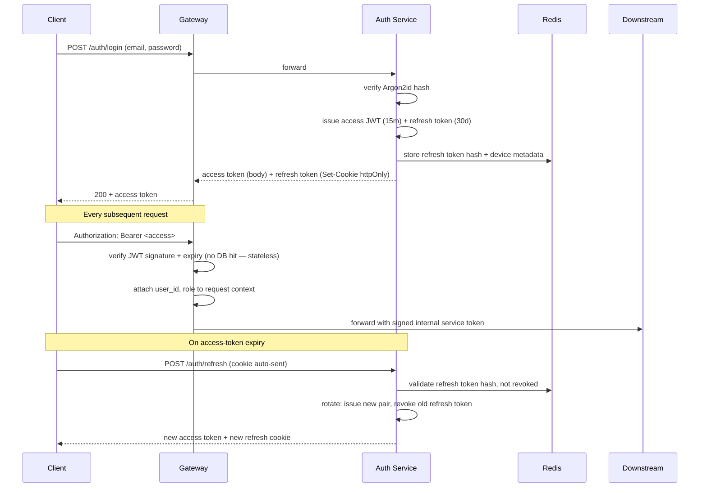

# TrustBuy AI — Security Architecture

Related: [../ARCHITECTURE.md](../ARCHITECTURE.md) · [RISK_ANALYSIS.md](RISK_ANALYSIS.md) · [TESTING_STRATEGY.md](TESTING_STRATEGY.md)

## 1. Authentication & authorization

- **Passwords**: Argon2id hashing (fallback bcrypt cost 12 if Argon2 unavailable on a runtime), never logged, never returned.
- **Tokens**: short-lived JWT access tokens (15 min, RS256, gateway holds the public key only), rotating refresh tokens stored **httpOnly, Secure, SameSite=Strict** cookies with server-side revocation list in Redis (supports "log out all devices").
- **RBAC**: `user` / `moderator` / `admin` roles enforced at the gateway via `trustbuy_auth` middleware and re-checked at each internal service (defense in depth — a compromised gateway token can't silently escalate).
- **Session management**: users can view and revoke active sessions/devices (`refresh_tokens` table); suspicious concurrent-session patterns trigger a step-up re-auth.
- **MFA**: TOTP-based, optional at launch, required for `admin`/`moderator` roles.

## 2. Authentication flow

## 3. Network & infrastructure

- Single public ingress: ALB → gateway (+ the Next.js app). All other services live in private subnets, unreachable from the internet.
- Service-to-service auth: short-lived signed internal JWTs (separate key from user-facing tokens) issued per-request by the gateway; each service verifies the signature and the claimed calling service identity.
- Security groups scoped per service tier (web, gateway, core, agents, data) — least-privilege, no wildcard `0.0.0.0/0` ingress beyond the ALB.
- Secrets (DB credentials, JWT signing keys, LLM API keys, SES creds) live in AWS Secrets Manager, injected at task-start, never baked into images or committed to the repo.
- All traffic TLS 1.2+ in transit; RDS and S3 encrypted at rest (KMS).

## 4. Input validation & injection prevention

- Every service boundary validates with Pydantic v2 models — reject unknown fields, enforce types/lengths/enums.
- SQLAlchemy parameterized queries exclusively — no raw string interpolation into SQL.
- File uploads (invoices, delivery images, refund chats): type/size allowlist, virus scan (ClamAV in the upload pipeline) before persisting to S3, re-encoded images (strip EXIF/metadata, defeat polyglot file attacks) before OCR.
- URLs submitted for investigation are validated against an SSRF-safe fetcher: DNS-resolved and re-checked against a private-IP-range blocklist immediately before every outbound request (not just once — protects against DNS rebinding), no redirects followed into internal address space, egress via a dedicated fetcher service with no access to internal service network.

## 5. Rate limiting & abuse prevention

- Redis token-bucket per-IP and per-user at the gateway; stricter limits for anonymous investigation requests than authenticated ones.
- Report submission, voting, and Copilot messages have dedicated per-user limits to prevent spam and cost abuse (LLM calls are a real marginal cost).
- CAPTCHA (or equivalent proof-of-work challenge) on signup and on anomalous submission velocity — never used to gate normal reads.
- See [USER_FLOWS.md](USER_FLOWS.md) §5.4 for community-specific abuse mitigations (duplicate detection, Sybil resistance, vote-manipulation down-weighting).

## 6. Data protection & privacy

- PII inventory: email, display name, uploaded invoices/delivery images/refund chats, IP address (audit logs only).
- Invoices/delivery images may contain addresses, partial card digits, phone numbers — OCR pipeline redacts detected card-number-like and government-ID-like patterns before persisting extracted text; original image access is restricted to the uploading user, assigned moderators on that specific report, and the pipeline service role.
- Users can request account deletion; a documented data-retention job hard-deletes PII while preserving anonymized report signal (report stays, `reporter_id` nulled + audit trail note) so community intelligence isn't erased by a single deletion request — this trade-off is logged in [DECISIONS.md](../DECISIONS.md).
- No PII in URL query strings or logs; structured logs pass through a redaction filter (`trustbuy_common`) for known PII field names.

## 7. AI-specific security

- **Prompt injection**: content extracted from third-party listings/reviews/ads is treated as untrusted data, never concatenated directly into a system prompt with instruction-following authority. Agent and Copilot prompts use structured tool/function-calling with the extracted content passed as clearly-delimited data, and outputs are schema-validated before use.
- **Copilot scope enforcement**: a lightweight intent classifier runs in front of the LLM to reject non-shopping queries before they reach the model (defense in depth beyond system-prompt instructions, since prompt-only restrictions are not reliably robust against adversarial input embedded in scraped content).
- **Evidence grounding**: Copilot and Fusion Engine explanations are retrieval-grounded (ChromaDB) against stored evidence, not free-generated, bounding hallucination and making every claim traceable.
- **Model/weight versioning**: every recommendation stores its `model_version` and `weight_snapshot` for reproducibility if a recommendation is disputed or audited later.

## 8. OWASP Top 10 mapping (summary)

| Risk | Mitigation |
|---|---|
| Broken access control | RBAC at gateway + per-service, ownership checks on every resource fetch |
| Cryptographic failures | Argon2id, TLS everywhere, KMS at rest |
| Injection | Pydantic validation, parameterized queries, sandboxed URL fetcher (SSRF) |
| Insecure design | Threat-modeled per service at design time (this document + [RISK_ANALYSIS.md](RISK_ANALYSIS.md)) |
| Security misconfiguration | IaC (Terraform) reviewed configs, no default credentials, hardened container images |
| Vulnerable components | Automated dependency scanning (Dependabot/Snyk) in CI |
| Auth failures | Short-lived JWT, rotating refresh, MFA for privileged roles, rate-limited login |
| Data integrity failures | Signed internal service tokens, CI artifact signing before deploy |
| Logging/monitoring failures | Centralized structured logs, alarms on auth anomalies, audit log on every privileged action |
| SSRF | Dedicated egress-isolated fetcher with per-request IP re-validation |

## 9. Compliance posture

- GDPR/CCPA-aligned data-subject rights (export, delete) from v1, even pre-EU-launch — cheaper to build in than retrofit.
- Terms of Service must include a clear, prominent dispute/appeal mechanism for sellers and marketplaces named in AVOID PURCHASE verdicts (see [RISK_ANALYSIS.md](RISK_ANALYSIS.md) — defamation risk).
