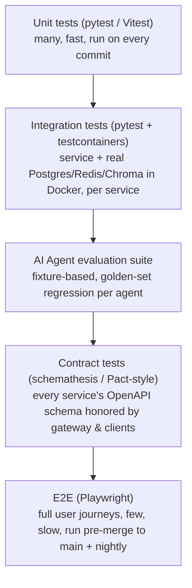

# TrustBuy AI — Testing Strategy

Related: [../ARCHITECTURE.md](../ARCHITECTURE.md) · [docs/SECURITY.md](SECURITY.md)

## 1. Test pyramid

Target ratio: ~70% unit, ~20% integration, ~10% e2e — standard pyramid, plus a **parallel, non-negotiable AI evaluation suite** that isn't optional the way it might be in a typical CRUD app, because agent regressions are silent and high-stakes here.

## 2. Backend (FastAPI services)

- **Unit**: pytest, one test module per service module; mock external calls (WHOIS, registries, LLM) via `respx`/fixtures.
- **Integration**: `testcontainers-python` spins ephemeral Postgres/Redis/Chroma per test run; verifies real SQLAlchemy models, Alembic migrations apply cleanly, actual query behavior.
- **Contract**: OpenAPI schema for every service is the source of truth; `schemathesis` fuzzes each endpoint against its schema in CI. The generated TypeScript client for the frontend is regenerated from the same schema, so drift breaks the frontend build, not silently ships.
- **Migration safety**: every Alembic migration gets a CI check that it applies to a snapshot of staging schema and is reversible (`downgrade` also tested).

## 3. Frontend (Next.js)

- **Unit/component**: Vitest + React Testing Library for components, hooks, and utility logic.
- **Visual regression**: Chromatic or Playwright screenshot diffing on core screens (recommendation result, evidence timeline, fraud network) across light/dark and mobile/desktop.
- **Accessibility**: `axe-core` automated checks in CI on every core page; manual screen-reader pass before each major release.
- **E2E**: Playwright covers the primary flows in [docs/USER_FLOWS.md](USER_FLOWS.md) — guest investigation → signup conversion → report filing → Copilot conversation → admin moderation.

## 4. AI agent & Fusion Engine evaluation

This is the part generic testing guides don't cover, and it's the highest-risk surface in the product.

- **Golden fixture sets** per agent: curated (product, seller, evidence) inputs with a human-labeled expected `verdict_signal` range and required evidence citations. Stored under `services/agents/*/tests/fixtures/`.
- **Regression gate**: any change to an agent or its weight table must run against the full golden set; a drop in agreement rate beyond a tolerance blocks merge.
- **Fusion Engine determinism test**: given a fixed set of `agent_runs`, the Fusion Engine must produce the same verdict + confidence every time (pure function property) — critical for auditability and dispute resolution.
- **Adversarial/prompt-injection suite**: fixtures containing scraped-content-style injection attempts ("ignore previous instructions...") fed through the Copilot and agents; test asserts the injected instruction is never followed and the response stays scoped (see [docs/SECURITY.md](SECURITY.md) §7).
- **Bias/fairness spot-checks**: periodic review that verdict distribution doesn't systematically disadvantage sellers by irrelevant attributes (e.g., geography alone) absent real evidence — tracked as a recurring manual audit, logged in [DECISIONS.md](../DECISIONS.md) if thresholds change.
- **Human-in-the-loop calibration**: a sample of AVOID PURCHASE verdicts is periodically reviewed by moderators against real outcomes to recalibrate weight tables (feeds the Historical Learning Agent).

## 5. Load & resilience testing

- **Load**: k6/Locust scripted runs simulating investigation bursts (e.g., a viral product) to validate agent-worker autoscaling on queue depth.
- **Chaos/failure injection**: kill an agent mid-investigation in staging to confirm the Fusion Engine correctly falls back to a `partial` recommendation rather than hanging or crashing.
- **Dependency timeout testing**: every external call (WHOIS, registries, LLM provider) has an enforced timeout + circuit breaker; tests assert the system degrades to `insufficient_data` rather than blocking the whole investigation.

## 6. Security testing

- **SAST**: Bandit (Python), ESLint security rules + `next lint` (TS), run in CI on every PR.
- **Dependency scanning**: Dependabot/Snyk, blocking on critical CVEs.
- **DAST**: OWASP ZAP baseline scan against staging on a schedule.
- **Pen testing**: third-party penetration test before public launch and annually thereafter (tracked in [ROADMAP.md](../ROADMAP.md)).
- Full detail in [docs/SECURITY.md](SECURITY.md).

## 7. CI/CD gates

A PR cannot merge unless: unit + integration tests pass, contract tests pass, lint/type-check pass, AI golden-set regression stays within tolerance, SAST has no new criticals, and (for frontend changes touching core screens) visual regression is reviewed. `main` deploys to `staging` automatically; `production` deploy is a manual promotion gate after smoke tests pass on staging.

## 8. Environments

`local` (docker-compose, seeded fixture data) → `dev` (shared, ephemeral) → `staging` (production-like, anonymized data snapshot) → `production`. No test ever runs against production data.
