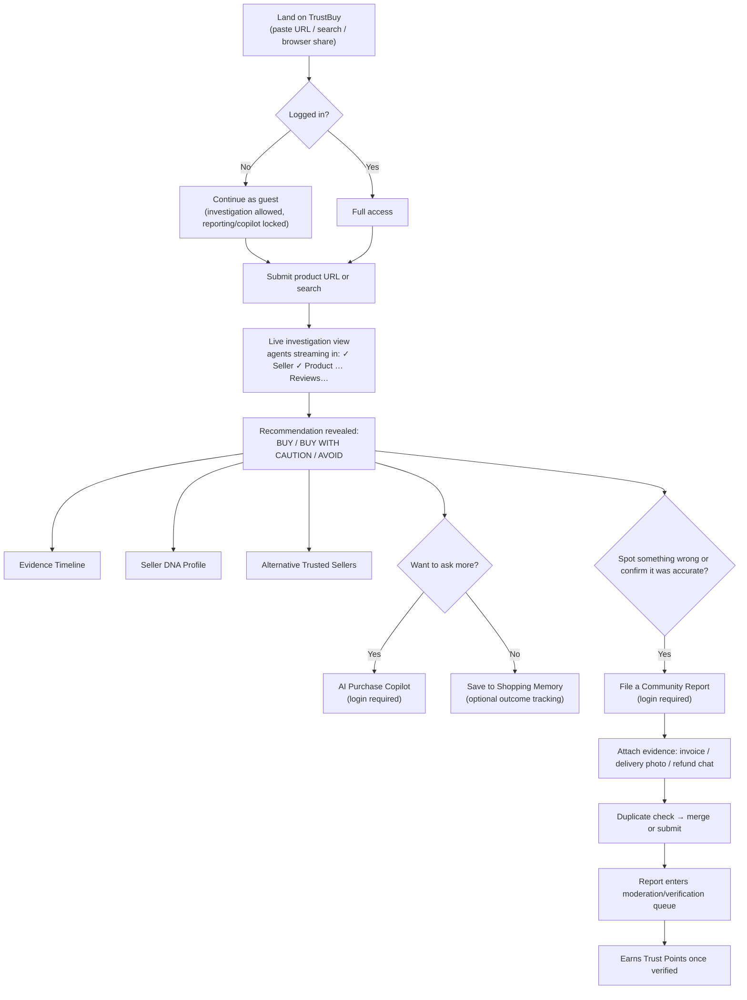
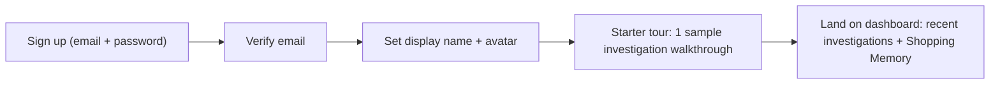
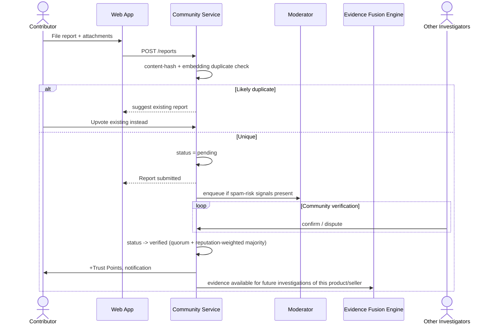
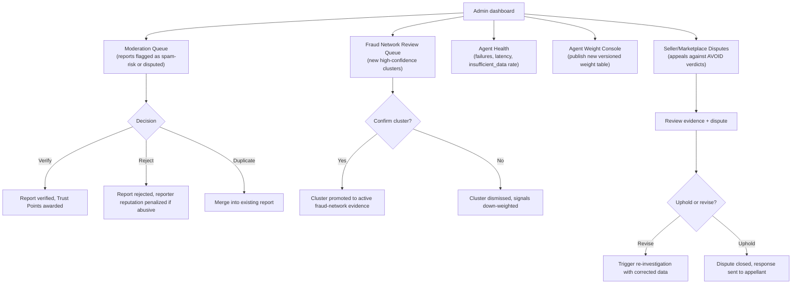

# TrustBuy AI — User Flows, Admin Flows & Community Reputation System

Related: [../ARCHITECTURE.md](../ARCHITECTURE.md) · [UI_UX_WIREFRAMES.md](UI_UX_WIREFRAMES.md) · [../DATABASE_SCHEMA.md](../DATABASE_SCHEMA.md)

## 1. Primary user flow — "Should I buy this?"



## 2. Onboarding flow



## 3. Community contribution flow (report lifecycle)



## 4. Admin / moderation flow



## 5. Community reputation system

### 5.1 Levels

| Level | Trust Points required | Unlocks |
|---|---|---|
| **Shopper** | 0 (default on signup) | Run investigations, use Copilot, save Shopping Memory |
| **Investigator** | 100 | File reports, vote on reports |
| **Fraud Hunter** | 500 | Verify/dispute others' reports, higher report weight |
| **Trust Guardian** | 2,000 | Flag fraud-network clusters for review, appeal-review visibility |
| **Trust Ambassador** | 8,000 + moderator-invited | Mentor queue, early access to new agents, direct escalation channel to moderators |

Point thresholds and weights live in a config table (`reputation_levels`), not hardcoded, so they can be tuned without a deploy.

### 5.2 Trust Point actions

| Action | Points |
|---|---|
| Report filed and later verified | +25 |
| Report verified by Fraud Hunter+ (bonus) | +10 |
| Useful vote (aligned with eventual consensus) | +2 |
| Report filed and rejected as false/spam | −30 |
| Duplicate/spam report submitted | −10 |
| Verification that matches eventual consensus | +5 |
| Verification that is later overturned | −5 |
| Genuine-purchase confirmation verified | +15 |

### 5.3 Reputation-weighted evidence

A report's contribution to the Evidence Fusion Engine is weighted by:

```
report_weight = base_weight(report_type)
              × reputation_multiplier(reporter.level)
              × corroboration_factor(verification_count, verifier_avg_reputation)
              × recency_decay(report_age)
```

This ensures a single low-reputation, unverified report never single-handedly drives an AVOID PURCHASE verdict (see [RISK_ANALYSIS.md](RISK_ANALYSIS.md) — defamation risk mitigation), while a corroborated pattern from trusted contributors carries real weight.

### 5.4 Spam & abuse prevention

- **Duplicate detection**: simhash of description + perceptual hash of attachments + embedding similarity against recent reports for the same product/seller.
- **Rate limiting**: per-user report submission caps (Redis token bucket), stricter for new accounts.
- **Sybil resistance**: reputation gains taper for accounts with correlated signup patterns (same IP/device fingerprint cluster) pending manual review.
- **Vote manipulation**: votes from accounts younger than a threshold, or from accounts detected in a fraud-network cluster with the reported seller, are down-weighted or excluded.
- **Penalty ledger**: every point change is logged in `trust_points_ledger` with a `reason`, fully auditable.

## 6. Alternate flows

- **Guest → conversion**: a guest who runs an investigation is prompted to sign up specifically to unlock the Copilot and reporting, at the point of highest intent (right after seeing the recommendation) — not at first page load.
- **Failed/partial investigation**: if agents time out, the UI clearly shows a `partial` badge and which agents didn't complete, with an option to retry.
- **Seller dispute**: a seller/marketplace representative can submit a dispute (public form, no login required to file, review requires evidence) routed straight into the Admin Moderation flow (§4).
